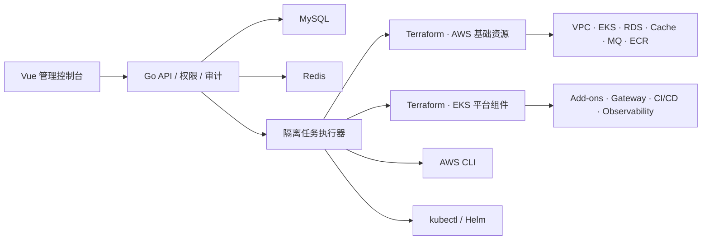

# AWSInfra · AWS 部署平台

[](https://github.com/GZ-Alinx/awsinfra/actions/workflows/ci.yml)
[](LICENSE)

面向 AWS/EKS 的项目化基础设施和应用交付平台。平台使用 Go 管理 Terraform、AWS CLI、kubectl 与 Helm，通过 Vue 3 + Arco Design Vue 提供项目、环境、权限、部署、日志、资源访问和 CI/CD 管理界面。

> 当前是首个公开版本。请先在独立 AWS 测试账号验证，再用于生产。Terraform 和 AWS 托管服务会产生实际费用。

## 能做什么

- 以项目为安全边界管理 `dev`、`test`、`uat`、`prod` 环境。
- 两阶段交付：AWS 基础资源/EKS，以及 Kubernetes 组件/TLS/域名/告警。
- 新建 VPC 或接入已有 VPC、EKS，支持多节点组、调度隔离和自动扩缩容。
- 创建 RDS/Aurora/DocumentDB、ElastiCache、MSK、Amazon MQ、ECR 等 AWS 服务。
- 安装 Higress、Jenkins、Argo CD、Prometheus、Grafana、Loki、Tempo、EFK、ClickVisual、OpenTelemetry、Consul、etcd 等组件。
- 项目级 AWS 凭据、用户权限、审计、任务互斥、Terraform State、失败诊断和安全重试。
- GitLab/Jenkins 项目接入、Dockerfile/Jenkinsfile/部署清单管理、构建日志与发布。
- EKS Ingress、TLS、域名转发、资源访问和应用拓扑统一管理。

## 架构



## 五分钟本地启动

前置条件：Go 1.25.13+、Node.js 20.19+、Docker Compose v2。创建 AWS/EKS 资源时还需要 Terraform 1.9+、AWS CLI v2、kubectl 和 Helm 3+。

```console
git clone https://github.com/GZ-Alinx/awsinfra.git
cd awsinfra

# 交互式设置管理员密码，并自动生成数据库、Redis 和凭据加密密钥。
# 已存在 .env 时会拒绝覆盖。
go run ./cmd/ops-deploy init --config config.yaml

# 启动 MySQL/Redis、构建前后端并运行平台。
make local
```

打开 [http://127.0.0.1:8080](http://127.0.0.1:8080)，用户名为 `admin`，密码是初始化时输入的密码。

完整步骤和常见问题见 [本地快速开始](docs/quick-start.md)。

## 第一次使用

1. 在“项目管理”创建项目和环境。
2. 在“AWS 凭据池”添加属于该项目的 AWS 身份并通过 STS 校验。
3. 项目选择明确绑定的凭据；平台不会回退到其他项目或机器默认凭据。
4. 配置 Region、VPC、EKS 节点组、云服务和组件。
5. 先生成并审查阶段 1 Terraform Plan，再创建基础资源。
6. EKS 验收通过后部署阶段 2 组件、TLS、域名和告警。
7. 在“资源与访问”和“任务与日志”查看实际端点、状态、诊断与交付结果。

建议先阅读 [环境从 0 到 1 的交付标准](docs/environment-delivery-standard.md)。

## 将平台自身部署到 EKS

仓库包含 Go 原生发布工具，不依赖发布 Shell：

```console
cp deploy/kubernetes/deploy.example.yaml deploy/kubernetes/deploy.yaml
cp deploy/kubernetes/secrets.env.example deploy/kubernetes/secrets.env
chmod 600 deploy/kubernetes/secrets.env

# 修改集群、Profile、StorageClass、域名和 Secret 后执行：
go run ./cmd/platform-deploy preflight --config deploy/kubernetes/deploy.yaml
go run ./cmd/platform-deploy deploy --config deploy/kubernetes/deploy.yaml
go run ./cmd/platform-deploy status --config deploy/kubernetes/deploy.yaml
```

发布工具使用独立 kubeconfig，不会改变本机当前 Context；会构建镜像、推送私有 ECR、渲染 Kubernetes 清单、滚动更新并执行健康检查。详细说明见 [平台部署到 EKS](docs/deploy-platform-to-eks.md)。

## 文档

| 文档 | 内容 |
|---|---|
| [快速开始](docs/quick-start.md) | 本地初始化、启动、停止、重置 |
| [配置参考](docs/configuration.md) | `config.yaml`、环境变量和目录 |
| [平台部署到 EKS](docs/deploy-platform-to-eks.md) | 镜像、ECR、Secret、Ingress、升级和回滚 |
| [AWS 权限模型](docs/aws-iam.md) | 项目身份、部署权限、最小权限建议 |
| [安全指南](SECURITY.md) | 密钥、网络、State、漏洞报告和生产加固 |
| [运维手册](docs/operations.md) | 备份、恢复、升级、巡检和故障处理 |
| [环境交付标准](docs/environment-delivery-standard.md) | 部署前门禁和部署后 Checklist |
| [可观测体系](docs/observability.md) | Metrics、Logs、Traces、告警与 Dashboard |
| [项目清单归档](docs/project-manifest-archive.md) | 已部署项目的 Helm/Kubernetes 清单归档 |
| [故障排查](docs/troubleshooting.md) | 登录、Terraform、EKS、Helm、NLB 常见问题 |

## 安全边界

- `.env`、kubeconfig、Terraform State、任务日志、项目环境配置和本地部署配置均被 Git 忽略。
- AWS Secret、GitLab Token、Jenkins 凭据和 TLS 私钥不会提交到仓库或写入普通任务日志。
- AWS 凭据按项目隔离并使用 AES-256-GCM 加密；生产建议使用 AssumeRole/短期 STS，而不是长期 AK/SK。
- 平台默认只监听 `127.0.0.1`；公网部署必须启用 HTTPS、Secure Cookie、API 白名单和最小权限。
- Terraform 变更前应审查保存的 Plan；销毁和高风险操作需要独立确认。

公开仓库中的示例域名、账号、Bucket 和项目均为占位值。不要将真实 `.env`、`deploy.yaml`、State、日志或项目归档加入 Git。

## 升级兼容性

项目品牌和开源仓库名称已统一为 **AWSInfra / AWS 部署平台**。为保证现有环境能够原地升级，CLI 命令 `ops-deploy`、Kubernetes 资源名、Terraform State 标识、标签及默认运行目录继续保留 `ops-deploy` / `ops-deploy-platform` 兼容名称；请勿仅因品牌变更手工重建这些资源。

## 开发与验证

```console
npm --prefix frontend ci
npm --prefix frontend run typecheck
npm --prefix frontend test
npm --prefix frontend run build
go test ./...
go vet ./...
terraform -chdir=terraform/infra init -backend=false
terraform -chdir=terraform/infra validate
terraform -chdir=terraform/platform init -backend=false
terraform -chdir=terraform/platform validate
```

提交代码前请阅读 [CONTRIBUTING.md](CONTRIBUTING.md)。

## License

Apache License 2.0，详见 [LICENSE](LICENSE)。
